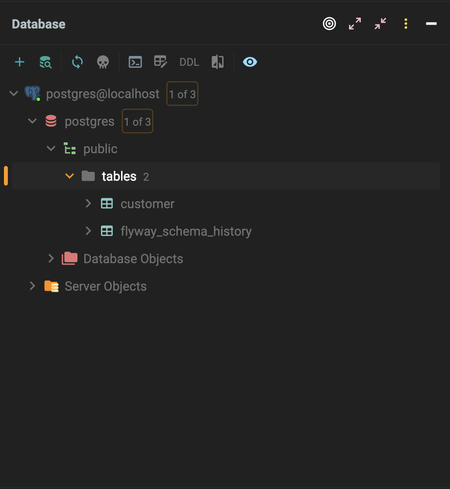
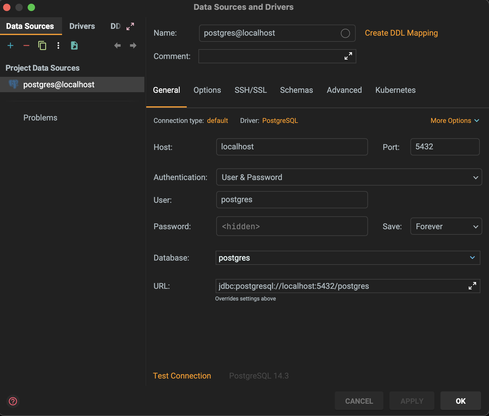

# Georgia-Express
DBMS Class term project

## Instructions to Setup:

### Pre-requisites:
Make sure the following is installed.
1. Docker (https://docs.docker.com/engine/install/)
2. Maven (https://maven.apache.org/install.html) (On Mac just do if you have home brew: `brew install maven`)
3. Java 22
4. Any IDE
5. Postman (https://www.postman.com/downloads/)
6. Node.js and npm (https://nodejs.org/en)

### Backend:
1. On IntelliJ, use the setup from version control to setup the repo
2. It should give you a prompt to load from Maven at the bottom right, click the Load button and the backend will be setup
3. To setup the database:
   - `cd docker`
   - `docker-compose up -d`
4. In the `backend` directory, run `mvn clean install` to initialize
5. Run the application, run the java file `GeorgiaExpressApplication.java`
6. To setup the Data Source on IntelliJ , click the database logo on the right hand corner of IntelliJ
7. Select the add logo here, 
8. This is how the adding look like: 
9. Get the password from the docker file and the database should appear
